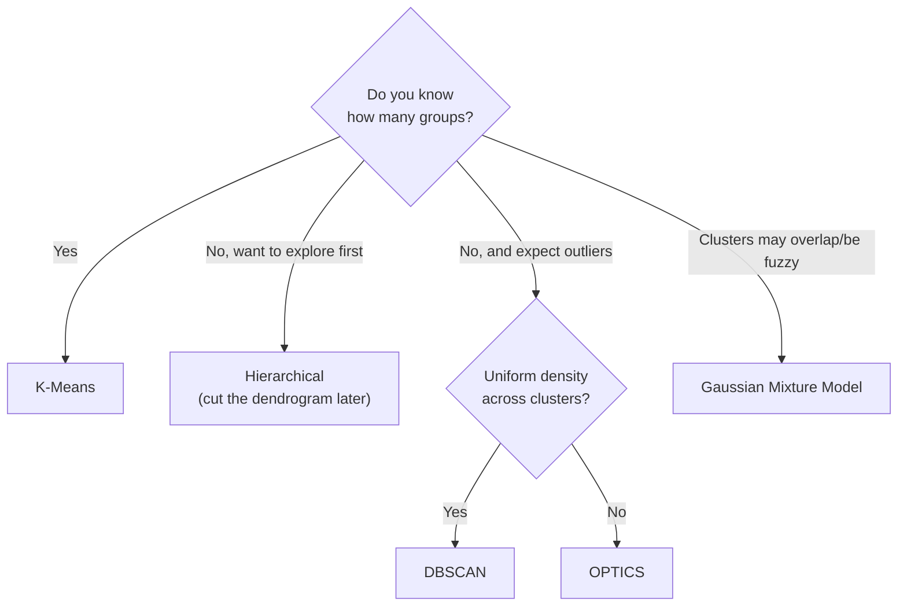

# Section 6.1 — Clustering

> Phase 5 always had a label to train against. Real data often doesn't — nobody hands you
> pre-defined customer segments. Clustering finds structure entirely on its own, and this
> section covers six genuinely different definitions of "a group."

## Why this matters for ML specifically

- Customer segmentation, anomaly pre-screening, and exploratory structure-finding on
  unlabeled data all start here.
- DBSCAN's "noise" concept is a direct bridge into Section 6.3 (Anomaly Detection).

## Real data, loaded directly from GitHub

**Mall Customers** — 200 real (anonymized) shoppers, with age, annual income, and a
spending score. Loaded with `pd.read_csv(url)` from
[`SteffiPeTaffy/machineLearningAZ`](https://raw.githubusercontent.com/SteffiPeTaffy/machineLearningAZ/master/Machine%20Learning%20A-Z%20Template%20Folder/Part%204%20-%20Clustering/Section%2025%20-%20Hierarchical%20Clustering/Mall_Customers.csv).

## Notebook

| # | Notebook | Topics covered |
|---|----------|-----------------|
| 1 | [`01_clustering_algorithms.ipynb`](notebooks/01_clustering_algorithms.ipynb) | K-Means (elbow + silhouette), Hierarchical (dendrogram), DBSCAN (density + noise), OPTICS (varying density), Gaussian Mixture Models (soft/probabilistic), Mean Shift (density peaks) |

## Choosing a clustering method



## Topic checklist

- [ ] K-Means
- [ ] Hierarchical
- [ ] DBSCAN
- [ ] OPTICS
- [ ] Gaussian Mixture Models
- [ ] Mean Shift

## How to run

```bash
pip install numpy pandas scikit-learn scipy matplotlib jupyterlab
jupyter lab
```

## Self-assessment

1. How do you choose `k` for K-Means, and what do the elbow method and silhouette score
   each tell you?
2. What does a dendrogram let you decide AFTER seeing the whole structure, that K-Means
   forces you to decide BEFORE?
3. What does DBSCAN's `-1` (noise) label mean, and why can't K-Means express that?
4. What does a Gaussian Mixture Model give you that K-Means's hard assignments can't?
5. Why doesn't Mean Shift require you to choose the number of clusters?
