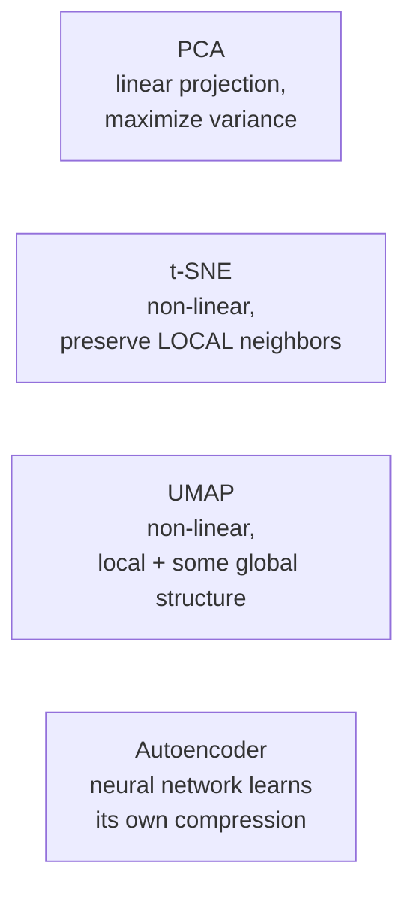

# Section 6.2 — Dimensionality Reduction

> You can't plot 13 dimensions, and many algorithms degrade in high-dimensional spaces
> (Section 4.1's curse of dimensionality). This section covers four genuinely different
> ways to compress many features down to a handful — from Module 1.1's linear PCA to a
> trained neural network.

## Why this matters for ML specifically

- PCA is the direct, practical payoff of Module 1.1's eigendecomposition derivation.
- t-SNE/UMAP are the standard tools for visualizing high-dimensional embeddings — you'll
  reach for them again with word/image embeddings in Phase 11-12.
- Autoencoders are your first from-scratch trained neural network compressor, a direct
  bridge into Phase 9.

## Real data, loaded directly from GitHub

**Wine** — 178 real wine samples, 13 chemical measurements, 3 known cultivars. Loaded from
[`rasbt/python-machine-learning-book`](https://raw.githubusercontent.com/rasbt/python-machine-learning-book/master/code/datasets/wine/wine.data)
(no header row in the raw file — column names are supplied manually).

## Notebook

| # | Notebook | Topics covered |
|---|----------|-----------------|
| 1 | [`01_dimensionality_reduction.ipynb`](notebooks/01_dimensionality_reduction.ipynb) | PCA (explained variance, loadings), t-SNE (perplexity, and its pitfalls), UMAP (vs. t-SNE tradeoffs), a from-scratch PyTorch Autoencoder |

## Four philosophies, one goal



## Topic checklist

- [ ] PCA
- [ ] t-SNE
- [ ] UMAP
- [ ] Autoencoders

## How to run

```bash
pip install numpy pandas scikit-learn umap-learn torch matplotlib jupyterlab
jupyter lab
```

## Self-assessment

1. What does PCA maximize, and what does "explained variance ratio" tell you?
2. Why can't you compare distances BETWEEN clusters on a t-SNE plot?
3. Name one practical advantage UMAP has over t-SNE.
4. What can an autoencoder capture that PCA structurally cannot?
5. Why did PCA already do well on the Wine dataset, when it might do poorly on images?
