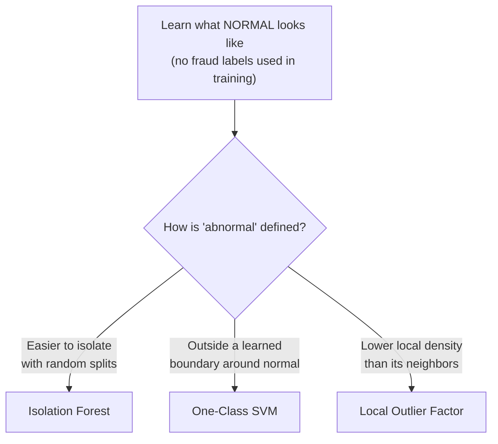

# Section 6.3 — Anomaly Detection

> Phase 5's Credit Risk project needed labeled defaults. Real fraud/anomaly detection often
> starts with almost no confirmed labels — so instead of learning "what does fraud look
> like," these methods learn "what does normal look like," and flag deviations from it.

## Why this matters for ML specifically

- This is the standard first line of defense in real fraud/intrusion detection systems,
  used before (or alongside) any supervised model.
- LOF's local-density idea is DBSCAN (Section 6.1) repurposed for scoring instead of
  grouping — the two sections directly reinforce each other.

## Real data, loaded directly from GitHub

**Credit Card Fraud Detection** — 284,807 real, anonymized European transactions from
September 2013, with only 492 (0.17%) confirmed fraud. Loaded from
[`nsethi31/Kaggle-Data-Credit-Card-Fraud-Detection`](https://raw.githubusercontent.com/nsethi31/Kaggle-Data-Credit-Card-Fraud-Detection/master/creditcard.csv)
— one of the most famous imbalanced datasets in ML. ⚠️ ~100MB; the first load takes a
moment.

## Notebook

| # | Notebook | Topics covered |
|---|----------|-----------------|
| 1 | [`01_anomaly_detection.ipynb`](notebooks/01_anomaly_detection.ipynb) | Isolation Forest (full 284K rows), One-Class SVM & LOF (on a stratified sample), evaluating unsupervised scores against labels you didn't train on |

## The core idea of this section



## Topic checklist

- [ ] Isolation Forest
- [ ] One-Class SVM
- [ ] LOF

## How to run

```bash
pip install numpy pandas scikit-learn matplotlib jupyterlab
jupyter lab
```

## Self-assessment

1. Explain Isolation Forest's "easier to isolate" intuition in your own words.
2. Why does Isolation Forest scale to 284,807 rows while One-Class SVM and LOF needed a
   sample?
3. How does LOF's density comparison relate to what DBSCAN does in Section 6.1?
4. How can you compute ROC AUC for an "unsupervised" method — doesn't that need labels?
5. What does `contamination`/`nu` actually control, and why did Exercise 1 show it barely
   affects ROC AUC?
