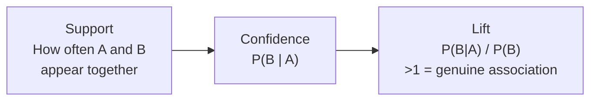

# Section 6.4 — Market Basket Analysis

> "Customers who bought X also bought Y" is one of the oldest, most directly profitable
> unsupervised techniques in retail. This section mines real grocery transaction data for
> exactly these patterns, with two algorithms guaranteed to find the identical answer via
> different routes.

## Why this matters for ML specifically

- Directly powers product placement, bundle deals, and "frequently bought together"
  recommendations in real retail systems.
- The support/confidence/lift vocabulary here reappears throughout recommendation systems
  (Section 6.5) and retail analytics more broadly.

## Real data, loaded directly from GitHub

**Groceries** — 9,835 real, anonymized grocery store transactions (the classic dataset
from R's `arules` package), loaded from
[`stedy/Machine-Learning-with-R-datasets`](https://raw.githubusercontent.com/stedy/Machine-Learning-with-R-datasets/master/groceries.csv) —
one line per transaction, a variable-length list of items (parsed manually, not a normal
tabular CSV).

## Notebook

| # | Notebook | Topics covered |
|---|----------|-----------------|
| 1 | [`01_market_basket_analysis.ipynb`](notebooks/01_market_basket_analysis.ipynb) | One-hot basket encoding, Apriori (level-by-level, apriori principle), FP-Growth (tree-based, no candidate generation), support/confidence/lift, why lift beats confidence alone |

## Support, Confidence, and Lift



## Topic checklist

- [ ] Apriori
- [ ] FP Growth

## How to run

```bash
pip install pandas mlxtend matplotlib jupyterlab
jupyter lab
```

## Self-assessment

1. State the "apriori principle" in your own words, and explain why it lets Apriori prune
   its search.
2. Why does FP-Growth typically run faster than Apriori, despite finding identical results?
3. Why can a rule have high confidence but be a misleading/uninteresting association?
4. What does a lift greater than 1 actually mean?
5. Why do we one-hot encode transactions before running either algorithm?
