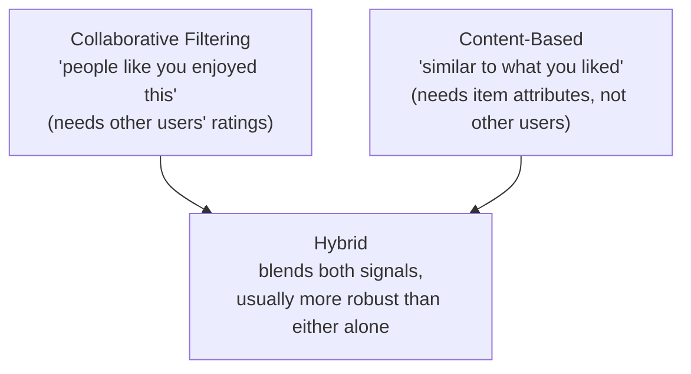

# Section 6.5 — Recommendation Systems

> This section is where clustering, similarity metrics (Module 1.1), and SVD (also Module
> 1.1!) all converge into one of the most commercially important applications in all of ML.

## Why this matters for ML specifically

- Every major platform you use daily (streaming, shopping, social feeds) runs on some
  blend of the three techniques in this notebook.
- Matrix factorization here is the direct, at-scale payoff of Module 1.1's SVD
  recommendation-systems preview.

## Real data, loaded directly from GitHub

**MovieLens (ml-latest-small)** — 100,836 real ratings from 610 users across 9,724 movies,
plus genre metadata, loaded from
[`sankalpjain99/Movie-recommendation-system`](https://raw.githubusercontent.com/sankalpjain99/Movie-recommendation-system/master/ratings.csv)
([`movies.csv`](https://raw.githubusercontent.com/sankalpjain99/Movie-recommendation-system/master/movies.csv)
for titles/genres).

## Notebook

| # | Notebook | Topics covered |
|---|----------|-----------------|
| 1 | [`01_recommendation_systems.ipynb`](notebooks/01_recommendation_systems.ipynb) | User-based & item-based Collaborative Filtering, SVD-based matrix factorization, Content-Based Filtering (genres), a Hybrid blend |

## Three strategies, one goal



## Topic checklist

- [ ] Collaborative Filtering
- [ ] Content Based
- [ ] Hybrid Systems

## How to run

```bash
pip install numpy pandas scikit-learn matplotlib jupyterlab
jupyter lab
```

## Self-assessment

1. What's the difference between user-based and item-based collaborative filtering?
2. How does SVD-based matrix factorization relate to what you derived by hand in Module
   1.1?
3. What problem does content-based filtering solve that collaborative filtering
   structurally can't (the "cold start" problem)?
4. Why do we normalize collaborative and content-based scores before blending them in the
   hybrid recommender?
5. Why did we filter to movies with at least 20 ratings before building the similarity
   matrices?
