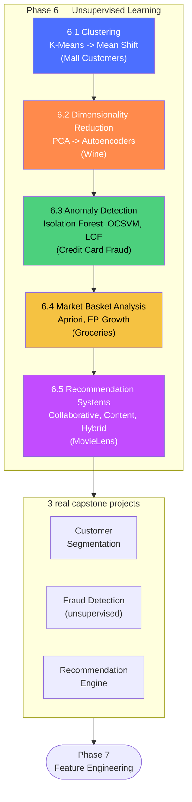

# Phase 6 — Unsupervised Learning

> Phase 5 always had a label to train against. This phase drops that assumption entirely —
> every technique here finds structure, compression, anomalies, associations, or
> recommendations from data with no labels at all. Every dataset is real, loaded directly
> from a public URL.

## How this phase is organized

## Every real dataset used in this phase

| Dataset | Rows | Used in | Source |
|---|---|---|---|
| Mall Customers | 200 | Clustering | [`SteffiPeTaffy/machineLearningAZ`](https://raw.githubusercontent.com/SteffiPeTaffy/machineLearningAZ/master/Machine%20Learning%20A-Z%20Template%20Folder/Part%204%20-%20Clustering/Section%2025%20-%20Hierarchical%20Clustering/Mall_Customers.csv) |
| Wine | 178 | Dimensionality Reduction | [`rasbt/python-machine-learning-book`](https://raw.githubusercontent.com/rasbt/python-machine-learning-book/master/code/datasets/wine/wine.data) |
| Credit Card Fraud | 284,807 | Anomaly Detection, Fraud Detection project | [`nsethi31/Kaggle-Data-Credit-Card-Fraud-Detection`](https://raw.githubusercontent.com/nsethi31/Kaggle-Data-Credit-Card-Fraud-Detection/master/creditcard.csv) |
| Groceries | 9,835 transactions | Market Basket Analysis | [`stedy/Machine-Learning-with-R-datasets`](https://raw.githubusercontent.com/stedy/Machine-Learning-with-R-datasets/master/groceries.csv) |
| MovieLens (ml-latest-small) | 100,836 ratings | Recommendation Systems, Recommendation Engine project | [`sankalpjain99/Movie-recommendation-system`](https://raw.githubusercontent.com/sankalpjain99/Movie-recommendation-system/master/ratings.csv) |
| Wholesale Customers | 440 | Customer Segmentation project | [UCI ML Repository](https://archive.ics.uci.edu/ml/machine-learning-databases/00292/Wholesale%20customers%20data.csv) |

## Sections

| Section | Core payoff |
|---|---|
| [6.1 Clustering](01-clustering/README.md) | Six ways to define "a group," compared side by side on the same real customers |
| [6.2 Dimensionality Reduction](02-dimensionality-reduction/README.md) | PCA through a real trained autoencoder, compared on data with known ground truth |
| [6.3 Anomaly Detection](03-anomaly-detection/README.md) | Finding the 0.17% that doesn't belong, in a 284,807-row real dataset |
| [6.4 Market Basket Analysis](04-market-basket-analysis/README.md) | Support/confidence/lift on real grocery baskets |
| [6.5 Recommendation Systems](05-recommendation-systems/README.md) | Collaborative, content-based, and hybrid recommenders on real movie ratings |

## Projects

- [ ] [Customer Segmentation](projects/customer-segmentation/README.md) — segment, profile, and NAME real B2B client groups
- [ ] [Fraud Detection](projects/fraud-detection/README.md) — an investigation-budget-aware ensemble anomaly system
- [ ] [Recommendation Engine](projects/recommendation-engine/README.md) — proper offline evaluation plus a concrete cold-start fix

## Before moving to Phase 7

You should be able to, without reference material:
1. Choose a clustering method based on whether you know `k`, expect noise, or need soft
   assignments
2. Explain what PCA/t-SNE/UMAP/autoencoders each optimize for, and when non-linearity earns
   its cost
3. Explain how Isolation Forest, One-Class SVM, and LOF each define "anomalous," and how to
   evaluate an unsupervised score against labels you didn't train on
4. Compute support, confidence, and lift, and explain why lift beats confidence alone
5. Explain the cold-start problem and why a hybrid recommender addresses it structurally

If any of these feel shaky, that section's `README.md` self-assessment will point you back
to the right notebook.
